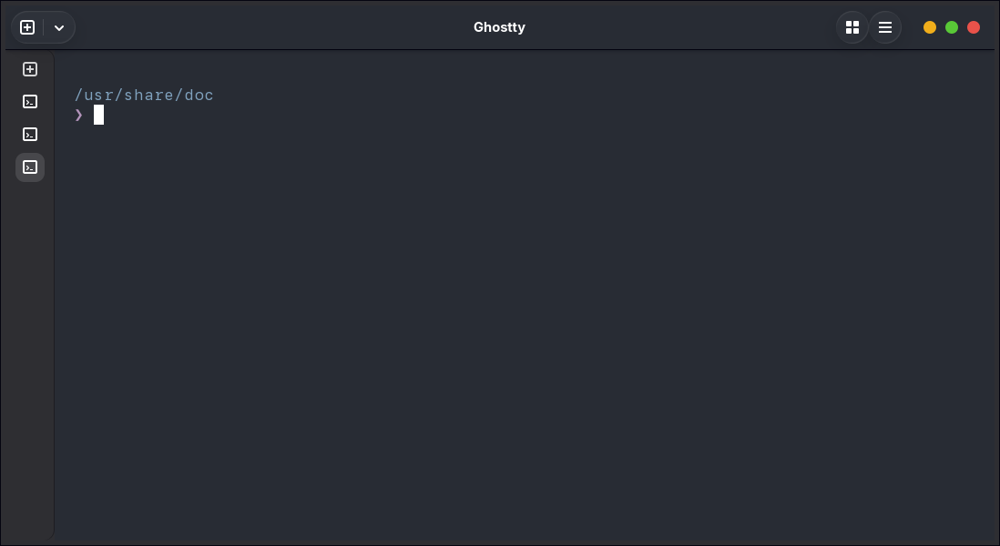
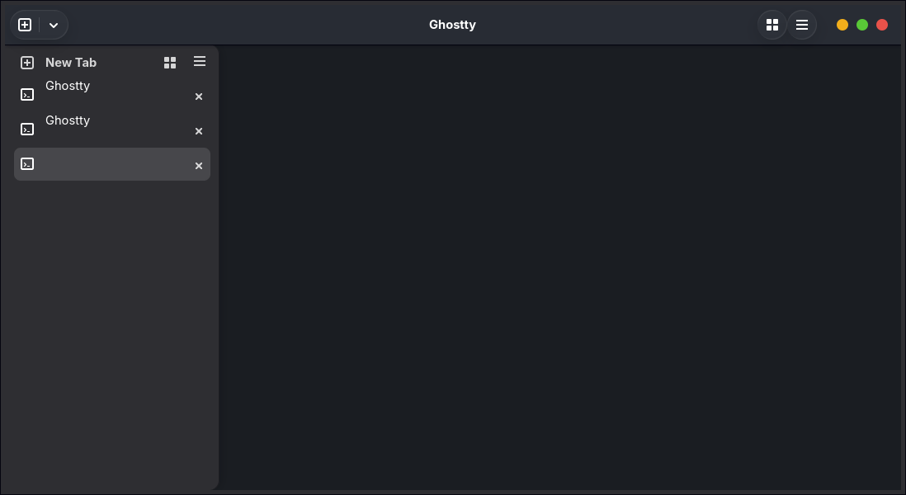

# Ghostty vertical tabs

Arc-browser-style vertical tabs in a left sidebar for [Ghostty](https://ghostty.org)
on Linux (GTK), delivered as a **patch against the official source** rather than
a fork.

Ghostty ships tabs horizontally only — `gtk-tabs-location` accepts `top`,
`bottom` and `hidden`. A horizontal strip stops being readable past a handful of
tabs. This adds `left` and `right`.

| Collapsed — an icon rail | Expanded on hover |
|---|---|
|  |  |

The rail is always there. Moving the pointer onto it expands it *over* the
terminal, so the terminal never reflows; typing or leaving collapses it again.
The icon column does not move between the two states — the panel only uncovers
text to the right of it.

## Why a patch and not a fork

Upgrading is then a version bump and a checksum rather than merging a parallel
tree. The change is deliberately additive: two new files plus a handful of hook
lines, so it conflicts far less than edits scattered through existing code.

```
patches/0001-gtk-vertical-tab-sidebar.patch   the change, against the v1.3.1 tag
PKGBUILD                                       official tarball + patch, for Arch
ci/smoke-test.sh                               proves the sidebar actually renders
.github/workflows/                             build, and a weekly upstream watcher
```

3689 insertions and 21 deletions across 12 files. Only 21 lines of upstream are
*removed*; that is the whole surface a future release can collide with.

Measured 2026-08-12: the patch applies cleanly to `v1.3.0`, `v1.3.1` and to
upstream `tip`. It conflicts with `v1.2.0` and older.

## Install (Arch)

```sh
git clone https://github.com/GFerreiroS/side-bar-ghostty
cd side-bar-ghostty
ZIG=/path/to/zig-0.15.2/zig makepkg -si
```

It builds the **official** `ghostty-1.3.1.tar.gz` from GitHub with the patch
applied. The package `provides=ghostty` and `conflicts=ghostty`, so it replaces
the repo package and keeps `ghostty-terminfo` / `ghostty-shell-integration`.

### Why `ZIG=` is needed

Ghostty v1.3.1 declares `minimum_zig_version = "0.15.2"`, and a minimum is not a
maximum: upstream's own port to Zig 0.16 landed *after* that tag, and Arch's repo
`zig` is 0.16 today. The PKGBUILD checks and fails with instructions rather than
dying halfway through a compile. Get the 0.15.2 tarball from
[ziglang.org/download](https://ziglang.org/download/).

### The `.sframe` workaround

Arch's binutils 2.47 / gcc 16 emit a `GNU_SFRAME` section in `/usr/lib/crt1.o`
with relocations Zig's ELF linker does not implement, so **Zig currently cannot
link anything against Arch's libc** — `pub fn main() void {}` with `-lc` fails
identically. `prepare()` probes for this and, only if the probe fails, strips the
section into a private CRT directory and points Zig at it. When either side
fixes this, the probe passes and none of it runs.

## Configuration

| Option | Default | |
|---|---|---|
| `gtk-tabs-location` | `top` | `left` and `right` are what this patch adds |
| `gtk-tabs-sidebar-mode` | `hover` | `hover`, `expanded`, `rail` — see below |
| `gtk-tabs-sidebar-width` | `54` | the rail, in px |
| `gtk-tabs-sidebar-expanded-width` | `260` | the panel, in px |
| `gtk-tabs-sidebar-icon-size` | `32` | the **chip** an icon sits in, not the glyph |
| `gtk-tabs-sidebar-corner-radius` | `12` | on the terminal-facing edge |
| `gtk-tabs-sidebar-border` | `true` | hairline against the terminal |
| `gtk-tabs-sidebar-animation-duration` | `320` | ms; `0` switches instantly |
| `gtk-tabs-sidebar-collapse-delay` | `400` | ms after the pointer leaves |
| `gtk-tabs-sidebar-auto-hide` | `true` | hide entirely while there is one tab |
| `gtk-tabs-sidebar-new-button` | `true` | show the "New Tab" row |
| `gtk-tabs-sidebar-subtitle` | `title` | `none`, `title`, `path` |
| `gtk-tabs-sidebar-git-branch` | `true` | one file watch per tab, on its repo's `HEAD` |
| `gtk-tabs-sidebar-indicators` | `true` | bell and read-only icons |
| `gtk-tabs-sidebar-theme-icons` | `false` | draw icons from your desktop theme |

### Modes

- **`hover`** — rests as the rail, opens over the terminal while the pointer is
  on it.
- **`expanded`** — always open, and reserves its width rather than overlaying.
- **`rail`** — never opens. Tab names go in tooltips instead, and the menu
  button stays on screen so the preferences are still reachable.

### Icons

By default the sidebar draws its icons from Adwaita regardless of your desktop
theme. That is not stubbornness: a rail is a column of glyphs that has to read as
one set, and icon themes disagree about these names — one popular theme draws
"new tab" as a bare cross filling its box directly above a terminal icon that is
a small boxed glyph, so the two will not sit together. Set
`gtk-tabs-sidebar-theme-icons = true` if matching your desktop matters more.

### Preferences dialog

The sidebar's "…" menu has **Sidebar Preferences**, which writes
`$XDG_CONFIG_HOME/ghostty/sidebar.conf` — a file the sidebar owns, so nothing
rewrites the config you maintain by hand. Precedence, lowest first: field
default, then `gtk-tabs-sidebar-*` from your config, then `sidebar.conf`.

"Reset to defaults" **deletes** that file rather than writing defaults into it,
so the sidebar goes back to following your config instead of having today's
values pinned over it.

## Maintenance

Truly zero maintenance is not achievable, and it would be dishonest to claim it.
What exists:

- **`.github/workflows/upstream.yml`** — weekly, and cheap on purpose. It finds
  the newest upstream tag and answers one question: does the patch still apply?
  When that goes red it means something real, and it opens an issue. It reads
  *tags*, because ghostty-org/ghostty publishes no GitHub release.
- **`.github/workflows/build.yml`** — builds the package in an Arch container and
  runs the smoke test.

Two failure modes no automation fixes: upstream editing the same lines (a human
rebases), and silent API drift where the patch applies, compiles, and is subtly
wrong because libadwaita changed underneath. `ci/smoke-test.sh` exists for the
second: it launches headless at two configured rail widths and asserts the
*difference*, which fails if the sidebar renders but has stopped reading its
configuration.

## Known limitations

- **Zig 0.15.x only**, and the `.sframe` workaround above — both are properties
  of the current Arch toolchain, not of this patch.
- `zig fetch` intermittently fails on one dependency (`ocornut/imgui`) while
  `curl` retrieves the same URL fine. Upstream's `fetch-zig-cache.sh` aborts on
  the first miss, so a build can fail for reasons unrelated to the patch. Retry.
- **`zig build test` does not cover this code.** Ghostty's test binary excludes
  the GTK apprt entirely, so a green suite says nothing here. The unit tests in
  `tab_sidebar_settings.zig` and `tab_sidebar_git.zig` have to be run directly.
- The git branch comes from reading `HEAD`, watched with a `GFileMonitor`. No
  libgit2 and no subprocess, which also means no dirty marker and no
  ahead/behind count.
- Tab labels fall back to the terminal title when the shell does not report its
  working directory — the screenshots above are from a session without shell
  integration, which is why they read "Ghostty".

## Licence

Ghostty is MIT. The patch is offered under the same terms.
